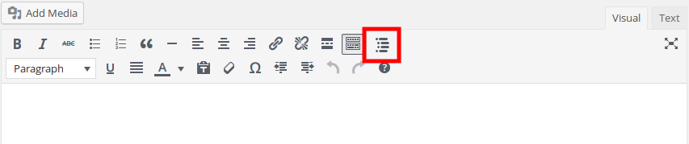
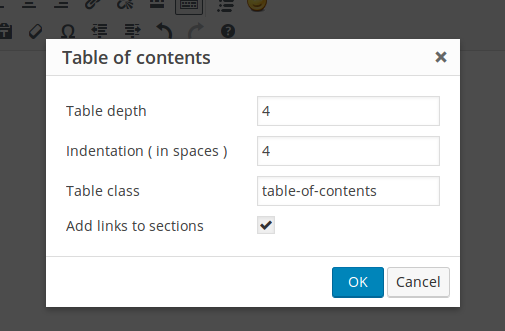

TinyMCE Table of Contents creator
=================================

  

A plugin for TinyMCE text editor & WordPress for creating tables of contents in an incredibly easy and personalizable way.

## Features
 - Configuration of the depth level of the table.
 - Configuration of the indentation of the levels of the table.
 - Option to add to the elements of the table link to each section.

### How is the indentation added?

The indentation of each level of the table is just a set of `&nbsp;`, styled with `white-space: pre;`, to make the browser preserve them.

### How are the links added?

The links are added by adding an `id` attribute to each title appearing in the table of contents, but only if it doesn't have it; original `id` attributes are not overwritten, not to break any other possible reference.

The format of the generated `id` is `section_x`, `section_x_y`, etc. Then, the link is just a hyperlink to the `id` (e.g., `<a href="#section_x">Section X</a>`).

## Installation
 1. Download it (check the [releases section](https://github.com/julenpardo/tinymce-table-of-contents/releases)).
 2. Unzip the contents into a `table-of-contents` named folder.
 3. Copy the folder into `/path/to/wordpress/wp-content/plugins`.
 4. Enable it from WordPress.

## Screenshots

*TinyMCE Table of Contents in the editor*

*Options for creating table of contents*

*Generated table of contents*
